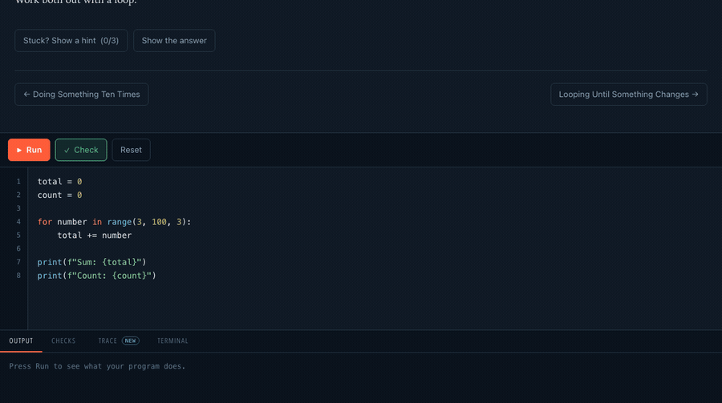
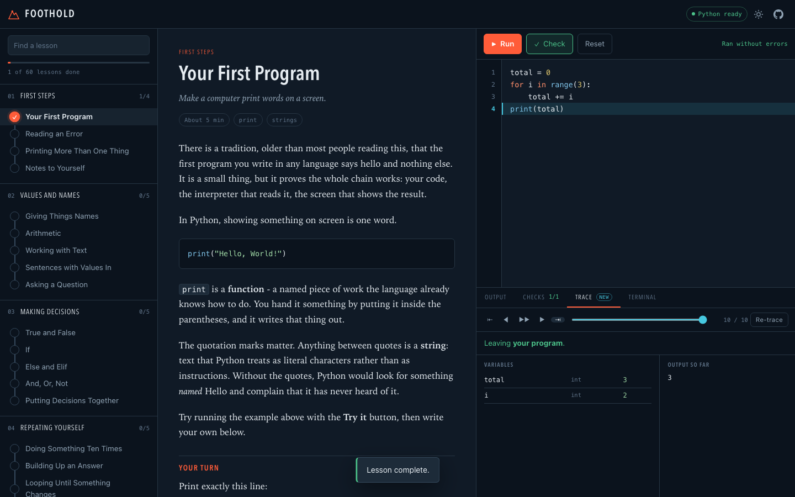

# Foothold

**Learn Python by watching your code run.**

A free, open source course that takes someone from never having programmed to
building a small application. 60 lessons, around eight hours, every answer
graded by executing it.

The part you will not find elsewhere: when an exercise fails, you can step
back through your own program a line at a time and watch the variables change
until you find the moment one stopped holding what you meant.

No account. No install. No server. Nothing you write leaves your computer.
[What that means exactly](PRIVACY.md), for anyone who has to justify the
choice to a school.

**[Start the course](https://jbtk-cell.github.io/foothold/)**



*A check fails. Press **Show me why**, scrub back through the program, and watch
`count` sit at zero while `total` climbs.*

---

## The trace

[Python Tutor](https://pythontutor.com) proved that watching execution
step-by-step is what beginners need. Five million people have used it. It is a
separate site you paste code into, so it sits outside whatever course you are
taking.

Foothold puts it inside the exercise. Every lesson has a Trace tab, and a
failed check offers a **Show me why** button that drops you into the recording
at the moment things went wrong.



Drag the slider and three things move together: the highlighted line in the
editor, the table of variables, and the output collected so far. Variables
that changed on this step are marked, with their previous value struck
through. Function calls push onto a call stack you can see.

The rewind is honest. Each step holds a snapshot rendered at the time, so
stepping backwards shows what was true then rather than what is true now.

---

## The rest of it

**A real interpreter.** CPython 3.14 compiled to WebAssembly, running in a
background thread. Real errors, real tracebacks, and a scratch prompt whose
namespace persists between lines. A `while True:` with no exit gets killed
after ten seconds and the runtime restarts, so a beginner's first infinite
loop costs them five seconds rather than the tab.

**Graded by running it.** Each exercise ships with Python tests that execute
against the learner's code. Any answer that works passes, including one nobody
planned for. Printing "all tests passed" achieves nothing.

**`input()` works.** A browser worker cannot block waiting for a keystroke, so
when a program asks for input Foothold asks the learner for that one line and
runs the program again with the answer appended. Programs at this level are
short and deterministic, so the re-run is invisible and the program appears to
ask its questions one at a time.

**Proven correct in CI.** The grading harness that runs in the browser is the
same file GitHub Actions imports. On every push, each reference solution must
pass its own tests and each starter must *fail* them, so an exercise that asks
the learner to do nothing cannot be merged.

**It tells you when it breaks.** Nothing is tracked, which leaves one real
hole: a site with analytics learns within the hour that it is broken on some
browser, and a site without them can go a year. So when the page throws, a note
offers to report it and the button opens a GitHub issue with the error, the
browser and the lesson already filled in. Nothing is sent unless the learner
presses it.

**Works with the wifi off.** The first visit caches all 60 lessons, not only
the pages you opened, so going offline at lesson three does not stop you
reaching lesson four. Clone the repository and it runs from a folder on your
disk with no toolchain.

**Survives a filtered network.** Python is fetched from four independent
sources. jsDelivr is DNS-blocked across mainland China and on plenty of school
networks, and a learner who cannot reach it has no course at all, so Foothold
falls through to jsDelivr's Fastly and Gcore hostnames and then to unpkg. When
every one of them is refused, the page says so in words a beginner can act on
instead of showing them a fetch error.

**Usable without a mouse or a working pair of eyes.** Every colour pair meets
WCAG AA in both themes. The editor takes Tab for indentation, and Escape then
Tab gets you out of it, which the page tells you rather than leaving you to
guess. A failed check is announced with the reason it failed. All of that is
checked on every push by `tools/check_access.mjs`, because it is the kind of
thing that breaks quietly.

---

## Running it locally

Python 3.9 or newer, and nothing else.

```bash
git clone https://github.com/jbtk-cell/foothold.git
cd foothold
./serve.sh
```

Then open <http://localhost:8000>.

The site is static files in `web/`. Any web server works; `npx serve web` and
`php -S` both do. It needs a server rather than a double-clicked
`index.html`, because browsers block ES modules and web workers on `file://`
URLs.

### Fully offline

Pyodide is fetched from a CDN on first load. To bundle it and cut the network
out completely:

```bash
./tools/vendor_pyodide.sh
```

That puts about 30 MB in `web/vendor/pyodide/`, which the worker prefers
whenever it exists. Worth doing for a classroom, a workshop on conference
wifi, or a filtered network.

---

## The course

| # | Module | Lessons | Covers |
| --- | --- | --- | --- |
| 01 | First Steps | 4 | `print`, reading an error, comments |
| 02 | Values and Names | 5 | variables, arithmetic, strings, f-strings, `input` |
| 03 | Making Decisions | 5 | booleans, `if`/`elif`/`else`, `and`/`or`/`not` |
| 04 | Repeating Yourself | 5 | `for`, `while`, accumulators, `break`, nesting |
| 05 | Functions | 5 | `def`, parameters, `return`, defaults, scope |
| 06 | Lists | 5 | indexing, iteration, methods, comprehensions |
| 07 | Dictionaries and Sets | 4 | lookups, counting, sets, nested data |
| 08 | Text | 3 | `split`/`join`, inspection, normalising input |
| 09 | When Things Go Wrong | 3 | `try`/`except`, `raise`, files |
| 10 | Build Something | 4 | FizzBuzz, a guessing game, a grade book, a to-do list |
| 11 | Objects of Your Own | 5 | classes, dunder methods, inheritance, dataclasses |
| 12 | Standing on Others' Work | 4 | imports, `collections`, `json`, `datetime` |
| 13 | Thinking in Algorithms | 4 | recursion, binary search, sorting, complexity |
| 14 | A Real Project | 4 | one task tracker, built across four lessons |

Progress lives in `localStorage` and exports to a file. There are no accounts
because there is no server.

---

## Contributing

Adding a lesson takes about ten minutes and needs no toolchain beyond Python.

```bash
python3 tools/new_lesson.py 06-lists "Slicing a List"
# edit the file it creates
python3 tools/build_manifest.py
python3 tools/validate.py
```

A lesson is one Markdown file that reads correctly on GitHub. The
machine-readable parts hide in ordinary fenced code blocks, tagged with a
second word:

````markdown
---
title: Your First Program
goal: Make a computer print words on a screen.
estimate: 5
---

Prose explaining the idea, with runnable examples.

```python starter
# what the learner opens with
```

```python solution
print("Hello, World!")
```

```python tests
def test_greeting():
    """It prints Hello, World!"""
    expect_output("Hello, World!")
```

```text hint
The first hint. Repeat the block for more.
```
````

Tests are ordinary Python, run in the same namespace as the learner's code, so
a test can call a function they defined. `STDOUT`, `STDOUT_LINES` and `SOURCE`
are available, along with helpers like `expect_output`, `expect_calling` and
`expect_defined`.

[CONTRIBUTING.md](CONTRIBUTING.md) has the full guide, including how to write
a failure message that teaches instead of accusing.

If you would rather improve the course than the code,
[docs/first-five-learners.md](docs/first-five-learners.md) is a method for
sitting with someone who has never programmed and writing down where they get
stuck. It is worth more than any amount of testing.

---

## Testing

```bash
python3 tools/validate.py              # harness, JS units, all 60 lessons
python3 tools/lint_prose.py            # writing quality
node tools/smoke_test.mjs              # end to end in a browser
node tools/check_in_browser.mjs        # grade all 60 in Pyodide
node tools/check_access.mjs            # contrast, keyboard, offline, blocked CDN
node tools/check_engines.mjs           # the same course in Safari and Firefox
```

Two more scripts make the pictures rather than checking anything:
`tools/make_demo_gif.mjs` records `docs/demo.gif` for the README, and
`tools/make_short_video.mjs` records `docs/short.mp4`, a 9:16 cut of the same
fifteen seconds, shaped for the phones where most people who cannot code yet
spend their time.

`validate.py` is the gate. Per lesson it checks that the reference solution
passes its own tests, that the starter fails them, that the starter is valid
Python, and that the browser's JavaScript lesson parser reads the file exactly
as the Python one does.

`lint_prose.py` checks the writing. The lessons are most of the product, so
the prose gets a linter: adverbs doing no work, telegraphed "not X, it's Y"
reversals, throat-clearing before the point. It fails the build on those and
warns about passive voice and sweeping claims.

`smoke_test.mjs` drives headless Chromium through booting Pyodide, completing
a lesson, recording a trace, answering an interactive `input()` prompt, and
recovering from an infinite loop.

`check_in_browser.mjs` grades all 60 reference solutions inside Pyodide, since
its filesystem and standard library are not identical to a desktop build.

`check_access.mjs` runs axe-core over both themes, completes a lesson using
only the keyboard, reads back what a screen reader would be told, blocks
jsDelivr to confirm the fallback sources work, blocks every source to confirm
the failure is explained, and pulls the network down to confirm an unopened
lesson still opens. It needs `npm install --no-save playwright axe-core`.

`check_engines.mjs` boots Python, runs a program and records a trace in WebKit
and Firefox. Foothold leans on a module worker, a dynamic import inside it, and
WebAssembly compilation, which are the three things those engines shipped later
than Chrome, and a gap in any of them leaves someone with no course at all.

---

## How it fits together

```
web/                  the whole site, static, no build step
  index.html
  js/
    worker.js         hosts Pyodide in a module worker
    runtime.js        main-thread client, timeouts and restarts
    editor.js         textarea over a highlighted layer
    highlight.js      a small Python tokenizer
    markdown.js       a small Markdown renderer
    lesson.js         lesson parser, mirroring tools/lesson.py
    ui/trace.js       the step-through debugger
    ui/hero-trace.js  the self-playing demonstration on the front page
  py/
    harness.py        the grader, shared by the browser and CI
    tracer.py         records every step, via sys.settrace
    console.py        the REPL behind the scratch terminal
  content/
    manifest.json     generated index of the curriculum
    curriculum/       the lessons
tools/                validation, tests, linting, authoring
```

Two rules hold the project together. `web/py/harness.py` is fetched by the
browser and imported by CI, so there is one grader rather than two that can
drift. And `web/js/lesson.js` mirrors `tools/lesson.py`, with CI diffing their
output on every lesson, so a learner's browser cannot read a lesson
differently from the validator that approved it.

---

## Design

The name came first and the interface followed. A foothold is the first thing
you trust your weight to.

The motif throughout is a marked line. Down the sidebar it is a climbing route
with a hold per lesson, filling in as you climb. Across the trace it is a tape
with a tick per recorded step. Section headings sit on a measuring rule with
major and minor marks. Same graphic idea, rotated.


Two colours carry meaning and never swap jobs. Vermilion is you: your route,
your progress, your turn. Cyan is the machine: execution, output, the trace. A
mark on screen tells you which of you it is about.

There are no webfonts, because the course has to work with the network off, so
the personality comes from system stacks: a condensed grotesque for display, a
serif for reading, and monospace for anything the machine said.

---

## Licence

[MIT](LICENSE). Use it, fork it, teach with it, translate it, sell a course
built on it. If you run it for a class, an issue saying so would be welcome.
