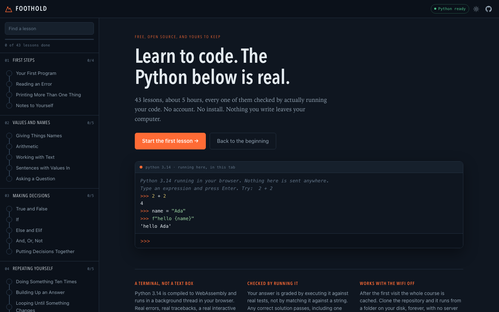

# Foothold

**Learn to code, with a real Python interpreter running inside the page.**

A free, open source course that takes someone from never having programmed to
writing working programs. 43 lessons, about five and a half hours, and every
answer is graded by actually executing it.

There is no account, no install, no build step, and no server. Nothing a
learner writes ever leaves their computer.

**[Start the course](https://jbtk-cell.github.io/foothold/)**



---

## What makes it different

**It is a terminal, not a text box.** Python 3.14 is compiled to WebAssembly
and runs in a background thread in the browser. Real errors, real tracebacks,
a real interactive prompt with a namespace that persists between lines. An
infinite loop is caught and killed instead of freezing the tab.

**Answers are graded by running them.** Each exercise ships with real Python
tests that execute against the learner's code. Any correct solution passes,
including one nobody anticipated - there is no string matching, and no way to
print your way to a pass.

**`input()` works.** A browser worker cannot block waiting for a keystroke, so
when a program asks for input Foothold asks the learner for that one line and
re-runs the program with the answer appended. Programs are short and
deterministic, so it is invisible: the program appears to ask its questions one
at a time, exactly like a terminal.

**Every lesson is proven correct in CI.** The same grading harness that runs in
the browser runs in GitHub Actions against every lesson: each reference
solution must pass its own tests, and each starter must *fail* them, so a
vacuous exercise cannot be merged.

**It works with the wifi off.** After the first visit the whole course is
cached by a service worker. Clone the repo and it runs from a folder on your
disk, with no toolchain at all.

---

## Running it locally

You need Python 3.9 or newer. That is the entire list.

```bash
git clone https://github.com/jbtk-cell/foothold.git
cd foothold
./serve.sh
```

Then open <http://localhost:8000>.

The site is plain static files in `web/`. Any web server will do -
`npx serve web`, `php -S`, whatever you have. It needs a *server* rather than
opening `index.html` directly, because browsers block ES modules and web
workers on `file://` URLs.

### Fully offline

By default Pyodide is fetched from a CDN on first load. To bundle it so the
course works with no network at all:

```bash
./tools/vendor_pyodide.sh
```

That downloads about 30 MB into `web/vendor/pyodide/`, which the worker prefers
over the CDN whenever it is present. Useful for a classroom, a conference
workshop, or anywhere the network is unreliable or filtered.

---

## The course

| # | Module | Lessons | What it covers |
| --- | --- | --- | --- |
| 01 | First Steps | 4 | `print`, reading an error, comments |
| 02 | Values and Names | 5 | variables, arithmetic, strings, f-strings, `input` |
| 03 | Making Decisions | 5 | booleans, `if`/`elif`/`else`, `and`/`or`/`not` |
| 04 | Repeating Yourself | 5 | `for`, `while`, accumulators, `break`, nesting |
| 05 | Functions | 5 | `def`, parameters, `return`, defaults, scope |
| 06 | Lists | 5 | indexing, iteration, methods, comprehensions |
| 07 | Dictionaries and Sets | 4 | lookups, counting, sets, nested data |
| 08 | Text | 3 | `split`/`join`, inspection, normalising input |
| 09 | When Things Go Wrong | 3 | `try`/`except`, `raise`, files |
| 10 | Build Something | 4 | FizzBuzz, a guessing game, a grade book, a to-do list |

Progress is stored in the browser's `localStorage` and can be exported to a
file and imported on another machine. There are no accounts because there is
no server.

---

## Contributing

Adding a lesson takes about ten minutes and needs no toolchain beyond Python.

```bash
python3 tools/new_lesson.py 06-lists "Slicing a List"
# edit the file it creates
python3 tools/build_manifest.py
python3 tools/validate.py
```

A lesson is one Markdown file that reads correctly on GitHub. The machine-
readable parts hide in ordinary fenced code blocks tagged with a second word:

````markdown
---
title: Your First Program
goal: Make a computer print words on a screen.
estimate: 5
---

Prose explaining the idea, with runnable examples.

```python starter
# what the learner opens with
```

```python solution
print("Hello, World!")
```

```python tests
def test_greeting():
    """It prints Hello, World!"""
    expect_output("Hello, World!")
```

```text hint
The first hint. Repeat the block for more.
```
````

Tests are ordinary Python. They run in the same namespace as the learner's
code, so a test can call a function they defined. `STDOUT`, `STDOUT_LINES` and
`SOURCE` are provided, along with helpers like `expect_output`,
`expect_calling` and `expect_defined`.

See [CONTRIBUTING.md](CONTRIBUTING.md) for the full guide, including how to
write a failure message that teaches rather than accuses.

---

## Testing

```bash
python3 tools/validate.py      # harness tests, JS unit tests, all 43 lessons
node tools/smoke_test.mjs      # end-to-end in a real browser (needs ./serve.sh)
```

`validate.py` is the gate. For every lesson it checks that the reference
solution passes its own tests, that the starter code fails them, that the
starter is valid Python, and that the browser's JavaScript lesson parser reads
the file identically to the Python one. CI runs it on every push.

`smoke_test.mjs` drives a headless Chromium through booting Pyodide,
completing a lesson, running a program, recovering from an infinite loop, and
answering an interactive `input()` prompt.

---

## How it fits together

```
web/                  the entire site - static, no build step
  index.html
  js/
    worker.js         hosts Pyodide in a module worker
    runtime.js        main-thread client, with timeouts and restarts
    editor.js         textarea over a highlighted layer
    highlight.js      a small Python tokenizer
    markdown.js       a small Markdown renderer
    lesson.js         lesson parser (mirrors tools/lesson.py)
  py/
    harness.py        the grader - shared by the browser and CI
    console.py        the REPL behind the terminal pane
  content/
    manifest.json     generated index of the curriculum
    curriculum/       the lessons themselves
tools/                validation, tests, and authoring helpers
```

The one design rule worth knowing: `web/py/harness.py` is fetched by the
browser and imported by CI. There is one grader, not two, so a lesson that
passes in CI provably passes for a learner.

---

## Why "Foothold"

A foothold is the first thing you trust your weight to. The interface borrows
from climbing guidebooks - the sidebar is a route, and the lessons are the
holds on it, filling in as you climb.

---

## Licence

[MIT](LICENSE). Use it, fork it, teach with it, translate it, sell a course
built on it. If you run it for a class, an issue saying so would be lovely but
is not required.
